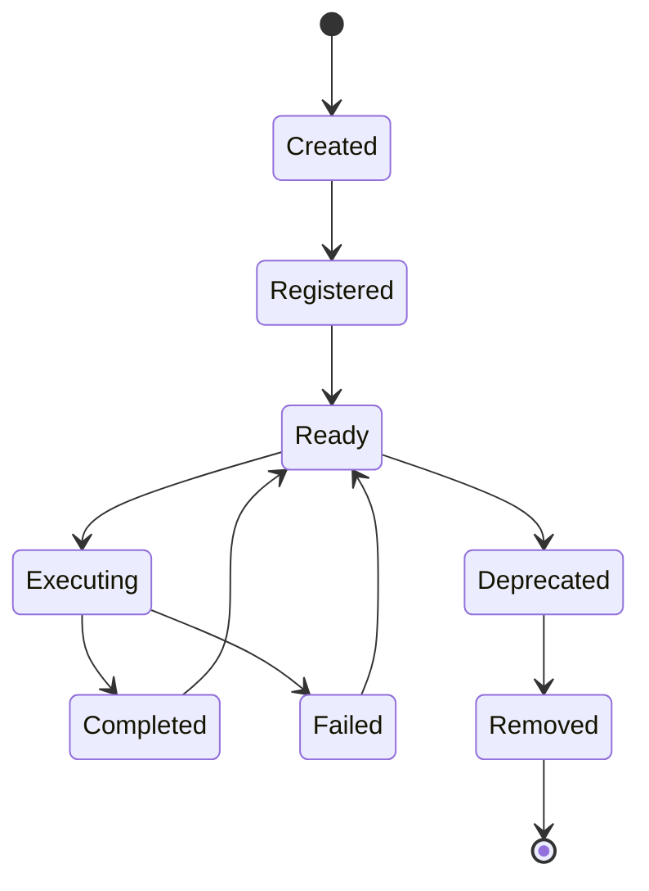

# Handler System Design

## Overview

This document describes the architecture of the handler system, including the three-role model (triggers, orchestrators, operators), domain organization, and design principles.

## Prerequisites

- Understanding of handler concepts and roles
- Knowledge of the overall system architecture
- Familiarity with role-based and domain-driven design
- Understanding of workflow orchestration

## Handler Role Model

### Three-Role Architecture

```
     User Input
         ↓
    [Triggers]
         ↓
  [Orchestrators]
         ↓
    [Operators]
         ↓
    Tool Layer
```

### Role Definitions

```yaml
roles:
  trigger:
    purpose: Respond to user commands
    characteristics:
      - User-facing
      - Natural language triggers
      - Entry points to system
      - Route to appropriate handlers
    location: handlers/triggers/[domain]/
    examples:
      - implement-feature
      - fix-bug
      - search-code
  
  orchestrator:
    purpose: Coordinate complex workflows
    characteristics:
      - Workflow management
      - Multi-handler coordination
      - State management
      - Cross-domain operations
    location: handlers/orchestrators/
    examples:
      - deployment-orchestrator
      - refactoring-orchestrator
      - testing-orchestrator
  
  operator:
    purpose: Perform specific technical tasks
    characteristics:
      - Atomic operations
      - Tool invocation
      - Technical implementation
      - Domain-specific logic
    location: handlers/operators/[domain]/
    examples:
      - compile-code
      - run-tests
      - analyze-complexity
```

## Domain Organization

### Domain Structure

```yaml
domains:
  development:
    description: Code implementation and features
    triggers:
      - implement-*
      - create-*
      - build-*
    operators:
      - code-generator
      - component-creator
      - module-builder
  
  git:
    description: Version control operations
    triggers:
      - commit-*
      - branch-*
      - merge-*
    operators:
      - git-add
      - git-commit
      - git-push
  
  search:
    description: Finding code and patterns
    triggers:
      - find-*
      - search-*
      - locate-*
    operators:
      - grep-search
      - file-finder
      - symbol-locator
  
  debug:
    description: Problem investigation
    triggers:
      - debug-*
      - investigate-*
      - trace-*
    operators:
      - stack-tracer
      - log-analyzer
      - error-investigator
  
  test:
    description: Testing and validation
    triggers:
      - test-*
      - validate-*
      - verify-*
    operators:
      - unit-tester
      - integration-tester
      - coverage-analyzer
  
  docs:
    description: Documentation operations
    triggers:
      - document-*
      - generate-docs
      - update-readme
    operators:
      - doc-generator
      - comment-adder
      - readme-updater
  
  workflow:
    description: Process management
    triggers:
      - setup-*
      - initialize-*
      - configure-*
    operators:
      - environment-setup
      - config-manager
      - dependency-installer
```

## Handler Lifecycle

### Handler States



### Lifecycle Management

```yaml
lifecycle:
  creation:
    - Define handler purpose
    - Write handler logic
    - Add YAML frontmatter
    - Create in correct location
  
  registration:
    - Add to registry
    - Update indexes
    - Link dependencies
    - Test discovery
  
  execution:
    - Validate inputs
    - Execute process
    - Handle errors
    - Return results
  
  maintenance:
    - Monitor performance
    - Fix bugs
    - Update documentation
    - Version updates
  
  deprecation:
    - Mark as deprecated
    - Provide alternative
    - Migration period
    - Remove when safe
```

## Handler Communication

### Communication Patterns

```yaml
patterns:
  direct_invocation:
    description: Handler calls another directly
    use_when: Clear dependency
    example: trigger → operator
  
  orchestrated:
    description: Orchestrator coordinates multiple handlers
    use_when: Complex workflow
    example: orchestrator → [operator1, operator2, operator3]
  
  chained:
    description: Output of one feeds input of next
    use_when: Sequential processing
    example: operator1 → operator2 → operator3
  
  parallel:
    description: Multiple handlers run simultaneously
    use_when: Independent operations
    example: parallel([operator1, operator2, operator3])
  
  conditional:
    description: Handler selected based on condition
    use_when: Branching logic
    example: if condition then handler1 else handler2
```

### Data Exchange

```yaml
data_exchange:
  input_output_contract:
    input:
      type: structured
      format: YAML/JSON
      validation: required
    output:
      type: structured
      format: YAML/JSON
      schema: defined
  
  context_sharing:
    method: context_object
    contains:
      - request_id
      - user_input
      - intermediate_results
      - error_state
  
  state_management:
    storage: memory/file
    scope: request/session
    persistence: optional
```

## Handler Discovery

### Discovery Mechanisms

```yaml
discovery:
  trigger_matching:
    method: pattern_matching
    sources:
      - Handler triggers array
      - Natural language processing
      - Keyword matching
  
  registry_lookup:
    method: index_search
    index: REGISTRY.md
    search_by:
      - Handler ID
      - Keywords
      - Domain
      - Role
  
  dynamic_discovery:
    method: runtime_search
    search:
      - File system scan
      - Metadata parsing
      - Dependency resolution
```

### Handler Resolution

```python
# Conceptual handler resolution
def resolve_handler(user_input):
    # 1. Check exact trigger match
    if exact_match := find_exact_trigger(user_input):
        return exact_match
    
    # 2. Check pattern match
    if pattern_match := find_pattern_trigger(user_input):
        return pattern_match
    
    # 3. Check keyword match
    if keyword_match := find_by_keywords(user_input):
        return keyword_match
    
    # 4. Use fallback
    return default_handler
```

## Handler Metadata

### Required Metadata

```yaml
required_metadata:
  id:
    type: string
    format: kebab-case
    unique: true
    example: implement-feature
  
  name:
    type: string
    format: human-readable
    example: "Feature Implementation Handler"
  
  role:
    type: enum
    values: [trigger, orchestrator, operator]
  
  domain:
    type: enum
    values: [development, git, search, debug, test, docs, workflow]
  
  version:
    type: string
    format: semver
    example: "1.0.0"
  
  status:
    type: enum
    values: [stable, beta, experimental, deprecated]
```

### Optional Metadata

```yaml
optional_metadata:
  triggers:
    type: array[string]
    description: Activation phrases
  
  dependencies:
    type: array[string]
    description: Required handlers
  
  tools:
    type: array[string]
    description: Tools used
  
  complexity:
    type: enum
    values: [simple, moderate, complex]
  
  performance:
    type: object
    properties:
      time: O-notation
      space: O-notation
  
  tags:
    type: array[string]
    description: Search tags
```

## Performance Architecture

### Optimization Strategies

```yaml
optimizations:
  handler_caching:
    strategy: LRU cache
    size: 100 handlers
    ttl: 3600 seconds
  
  lazy_loading:
    strategy: Load on demand
    preload: Common handlers only
  
  parallel_execution:
    strategy: Thread pool
    max_workers: 10
    queue_size: 100
  
  result_caching:
    strategy: Key-based cache
    key: handler_id + input_hash
    ttl: 300 seconds
```

### Resource Management

```yaml
resource_limits:
  per_handler:
    max_execution_time: 30s
    max_memory: 512MB
    max_file_handles: 100
  
  global:
    max_concurrent_handlers: 50
    max_total_memory: 4GB
    max_queue_size: 1000
```

## Error Handling Architecture

### Error Categories

```yaml
error_categories:
  validation_errors:
    - Invalid input
    - Missing required fields
    - Type mismatches
    handling: Return error to user
  
  execution_errors:
    - Handler failure
    - Tool unavailable
    - Timeout exceeded
    handling: Retry or fallback
  
  system_errors:
    - Out of memory
    - Disk full
    - Network failure
    handling: Graceful degradation
  
  dependency_errors:
    - Handler not found
    - Circular dependency
    - Version conflict
    handling: Resolution or abort
```

### Error Recovery

```yaml
recovery_strategies:
  retry:
    max_attempts: 3
    backoff: exponential
    conditions:
      - Transient errors
      - Network issues
  
  fallback:
    strategies:
      - Alternative handler
      - Cached result
      - Default value
  
  compensation:
    strategies:
      - Rollback changes
      - Cleanup resources
      - Notify user
```

## Testing Architecture

### Test Levels

```yaml
test_levels:
  unit_tests:
    scope: Individual handler
    coverage: 80%+
    focus:
      - Logic correctness
      - Error handling
      - Edge cases
  
  integration_tests:
    scope: Handler interactions
    coverage: 60%+
    focus:
      - Communication
      - Data flow
      - Dependencies
  
  system_tests:
    scope: End-to-end workflows
    coverage: Critical paths
    focus:
      - User scenarios
      - Performance
      - Reliability
```

## Security Considerations

### Security Model

```yaml
security:
  input_validation:
    - Sanitize all inputs
    - Validate against schema
    - Reject malicious patterns
  
  execution_isolation:
    - Sandbox handlers
    - Limit resource access
    - Prevent side effects
  
  access_control:
    - Handler permissions
    - Tool restrictions
    - File system limits
  
  audit_trail:
    - Log all executions
    - Track state changes
    - Monitor anomalies
```

## Evolution Strategy

### Versioning Strategy

```yaml
versioning:
  handler_versions:
    format: semver
    compatibility:
      - Major: Breaking changes
      - Minor: New features
      - Patch: Bug fixes
  
  migration:
    strategy: Blue-green
    process:
      - Deploy new version
      - Run in parallel
      - Gradual switch
      - Deprecate old
```

### Extension Points

```yaml
extension:
  new_roles:
    process:
      - Define role purpose
      - Create directory
      - Update architecture
  
  new_domains:
    process:
      - Identify domain need
      - Create structure
      - Add handlers
  
  new_patterns:
    process:
      - Document pattern
      - Create examples
      - Update guidelines
```

## Best Practices

### Design Guidelines

1. **Single Responsibility**: Each handler does one thing well
2. **Clear Interfaces**: Well-defined inputs and outputs
3. **Error Resilience**: Handle failures gracefully
4. **Performance Aware**: Optimize for common cases
5. **Well Documented**: Clear purpose and usage
6. **Testable**: Easy to test in isolation
7. **Maintainable**: Simple to understand and modify

### Anti-Patterns to Avoid

1. **God Handlers**: Doing too much in one handler
2. **Hidden Dependencies**: Undocumented requirements
3. **Tight Coupling**: Direct implementation dependencies
4. **Missing Error Handling**: Unhandled edge cases
5. **Poor Naming**: Unclear or misleading names
6. **No Versioning**: Breaking changes without notice
7. **Missing Tests**: Untested critical paths

## Related Resources

- [System Architecture](system-architecture.md)
- [Template Architecture](template-architecture.md)
- [Creating Handlers](../guides/creating-handlers.md)
- [Handler Design](../best-practices/handler-design.md)
- Handler implementations in `templates/handlers/`