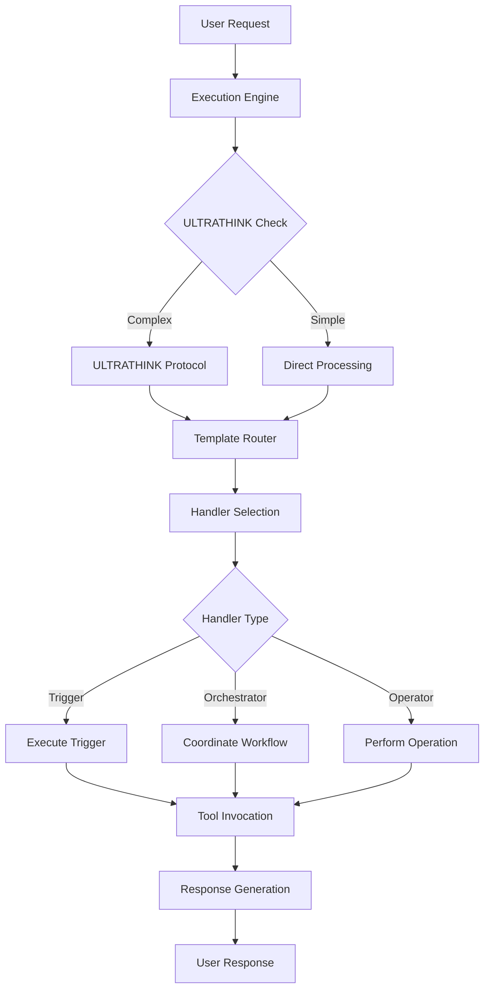

# Overall System Architecture

## Overview

This document describes the complete architecture of the Claude Template System, including its modular structure, component interactions, and design principles.

## Prerequisites

- Deep understanding of system design principles
- Knowledge of the template system's evolution
- Familiarity with handler-based architectures
- Understanding of modular design patterns

## System Evolution

### Historical Context

```markdown
## From Monolith to Modular

### Phase 1: Monolithic (Original)
```
.claude/
└── CLAUDE.md  # 1400+ lines, everything in one file
```

### Phase 2: Template Separation
```
templates/
├── CLAUDE.md
├── REGISTRY.md
├── templates/workflows/
├── TOOLS.md
└── templates/conventions/
```

### Phase 3: Handler Extraction
```
templates/
├── handlers/
│   ├── triggers/
│   ├── orchestrators/
│   └── operators/
└── *.md  # Core templates
```

### Phase 4: Full Modularization (Current)
```
templates/
├── engine/        # Execution engine
├── handlers/      # Handler library
├── integration/   # Extension guides
└── *.md          # Core templates
```
```

## Current Architecture

### System Layers

```
┌────────────────────────────────────────┐
│         User Interface Layer         │
│    (Natural language interaction)    │
├────────────────────────────────────────┤
│        Execution Engine Layer        │
│  (ULTRATHINK, Enforcement, Context)  │
├────────────────────────────────────────┤
│         Template System Layer        │
│    (Templates, Registry, Routing)    │
├────────────────────────────────────────┤
│          Handler System Layer        │
│  (Triggers, Orchestrators, Operators)│
├────────────────────────────────────────┤
│           Agent System Layer         │
│   (Specialists, Coordinators, Meta)  │
├────────────────────────────────────────┤
│            Tool System Layer         │
│    (Read, Write, Grep, MultiEdit)    │
└────────────────────────────────────────┘
```

### Component Architecture

```yaml
components:
  execution_engine:
    location: templates/engine/
    subcomponents:
      - activation: Context-aware activation
      - core: ULTRATHINK protocol
      - enforcement: Behavioral constraints
      - execution: SWHE format handling
      - navigation: Template routing
    responsibilities:
      - Process every request
      - Enforce protocols
      - Route to handlers
  
  template_system:
    location: templates/
    subcomponents:
      - REGISTRY.md: Handler index
      - templates/workflows/: Workflow patterns
      - templates/conventions/: Standards
      - USER-GUIDE.md: User documentation
    responsibilities:
      - Define workflows
      - Maintain standards
      - Provide navigation
  
  handler_system:
    location: templates/handlers/
    subcomponents:
      - triggers: User-activated handlers
      - orchestrators: Coordination handlers
      - operators: Technical handlers
    responsibilities:
      - Execute specific tasks
      - Coordinate workflows
      - Perform operations
  
  agent_system:
    location: .claude/agents/
    subcomponents:
      - specialists: Domain experts
      - coordinators: Multi-agent orchestration
      - meta: System management
    responsibilities:
      - Specialized processing
      - Complex coordination
      - System optimization
  
  tool_system:
    builtin: true
    tools:
      - Read: File reading
      - Write: File creation
      - Grep: Pattern search
      - MultiEdit: File modification
      - Glob: File discovery
    responsibilities:
      - File operations
      - Search capabilities
      - Code modification
```

## Information Flow

### Request Processing Flow



### Data Flow Architecture

```yaml
data_flow:
  input_processing:
    - User provides natural language input
    - Engine parses and understands intent
    - Context extracted from request
  
  routing:
    - Registry searched for matching handlers
    - Handler selected based on triggers
    - Parameters extracted and validated
  
  execution:
    - Handler process initiated
    - Tools invoked as needed
    - State managed throughout
  
  output_generation:
    - Results collected and formatted
    - Response constructed
    - Context preserved for follow-up
```

## Module Interactions

### Direct Dependencies

```yaml
dependencies:
  engine:
    depends_on:
      - templates: For routing rules
      - handlers: For execution
    provides:
      - Request processing
      - Protocol enforcement
  
  handlers:
    depends_on:
      - tools: For operations
      - engine: For context
    provides:
      - Task execution
      - Workflow coordination
  
  agents:
    depends_on:
      - handlers: For basic operations
      - tools: For file operations
    provides:
      - Specialized processing
      - Complex coordination
  
  templates:
    depends_on:
      - handlers: References for execution
    provides:
      - Navigation structure
      - Documentation
```

### Communication Patterns

```markdown
## Inter-Module Communication

### 1. Synchronous Calls
Direct function/handler invocation:
- Engine → Handler
- Handler → Tool
- Orchestrator → Operator

### 2. Asynchronous Messages
Event-driven communication:
- Agent → Agent
- Handler → Logger
- System → Monitor

### 3. Shared State
Common data structures:
- Context object
- Session state
- Work tracking files
```

## Scalability Architecture

### Horizontal Scaling

```yaml
scaling_points:
  handler_level:
    - Parallel handler execution
    - Load distribution
    - Resource pooling
  
  agent_level:
    - Multiple agent instances
    - Task distribution
    - Result aggregation
  
  tool_level:
    - Concurrent tool operations
    - Connection pooling
    - Batch processing
```

### Performance Optimization

```yaml
optimizations:
  caching:
    - Template caching
    - Handler result caching
    - Tool output caching
  
  lazy_loading:
    - Load handlers on demand
    - Defer template parsing
    - Stream large files
  
  batching:
    - Batch tool operations
    - Group similar requests
    - Aggregate responses
```

## Security Architecture

### Security Layers

```yaml
security:
  input_validation:
    - Sanitize user input
    - Validate parameters
    - Check boundaries
  
  access_control:
    - Handler permissions
    - Tool restrictions
    - File access limits
  
  audit_logging:
    - Track all operations
    - Log state changes
    - Monitor anomalies
  
  sandboxing:
    - Isolated execution
    - Resource limits
    - Timeout enforcement
```

## Fault Tolerance

### Failure Handling

```yaml
fault_tolerance:
  handler_failures:
    strategy: retry_with_backoff
    fallback: alternative_handler
    recovery: restore_state
  
  tool_failures:
    strategy: circuit_breaker
    fallback: cached_results
    recovery: manual_intervention
  
  system_failures:
    strategy: graceful_degradation
    fallback: essential_services_only
    recovery: progressive_restoration
```

### Recovery Mechanisms

```markdown
## System Recovery

1. **Checkpoint Recovery**
   - Save state at checkpoints
   - Restore from last checkpoint
   - Resume operation

2. **Rollback Recovery**
   - Track changes
   - Reverse operations
   - Restore original state

3. **Forward Recovery**
   - Skip failed operation
   - Continue with defaults
   - Log for later resolution
```

## Extension Points

### Adding New Components

```yaml
extension_points:
  new_handlers:
    location: templates/handlers/
    process:
      - Create handler file
      - Add YAML frontmatter
      - Register in system
  
  new_agents:
    location: .claude/agents/
    process:
      - Define agent contract
      - Implement logic
      - Integrate with coordinator
  
  new_tools:
    location: External or internal
    process:
      - Define tool interface
      - Create wrapper handler
      - Add to tool registry
  
  new_templates:
    location: templates/
    process:
      - Create template file
      - Add to navigation
      - Update references
```

## Monitoring and Observability

### System Metrics

```yaml
metrics:
  performance:
    - Request latency
    - Handler execution time
    - Tool operation duration
    - Cache hit rates
  
  reliability:
    - Success rates
    - Error frequencies
    - Recovery times
    - Availability percentage
  
  usage:
    - Request volume
    - Handler invocations
    - Tool usage patterns
    - Resource consumption
```

### Observability Stack

```yaml
observability:
  logging:
    - Structured logs
    - Correlation IDs
    - Log aggregation
  
  tracing:
    - Distributed tracing
    - Request flow tracking
    - Performance profiling
  
  monitoring:
    - Real-time dashboards
    - Alert rules
    - Anomaly detection
```

## Future Architecture

### Planned Enhancements

```yaml
future_enhancements:
  dynamic_loading:
    - Load handlers dynamically
    - Hot reload templates
    - Plugin architecture
  
  distributed_execution:
    - Distribute handlers across nodes
    - Parallel processing
    - Load balancing
  
  ai_optimization:
    - Learn usage patterns
    - Optimize handler selection
    - Predictive caching
  
  version_management:
    - Handler versioning
    - Template versioning
    - Backward compatibility
```

## Architecture Principles

### Design Principles

1. **Modularity**: Independent, focused components
2. **Extensibility**: Easy to add new capabilities
3. **Resilience**: Graceful failure handling
4. **Performance**: Optimized for common cases
5. **Maintainability**: Clear structure and documentation
6. **Testability**: Components testable in isolation
7. **Observability**: Comprehensive monitoring

### Trade-offs

```yaml
trade_offs:
  modularity_vs_performance:
    choice: modularity
    reason: Maintainability over micro-optimizations
  
  flexibility_vs_simplicity:
    choice: balanced
    reason: Simple defaults, flexible when needed
  
  consistency_vs_availability:
    choice: availability
    reason: Better to degrade than fail completely
```

## Related Resources

- [Handler Architecture](handler-architecture.md)
- [Template Architecture](template-architecture.md)
- [System Integration](../guides/system-integration.md)
- [Integration Patterns](../best-practices/integration-patterns.md)
- Current implementation in `templates/`