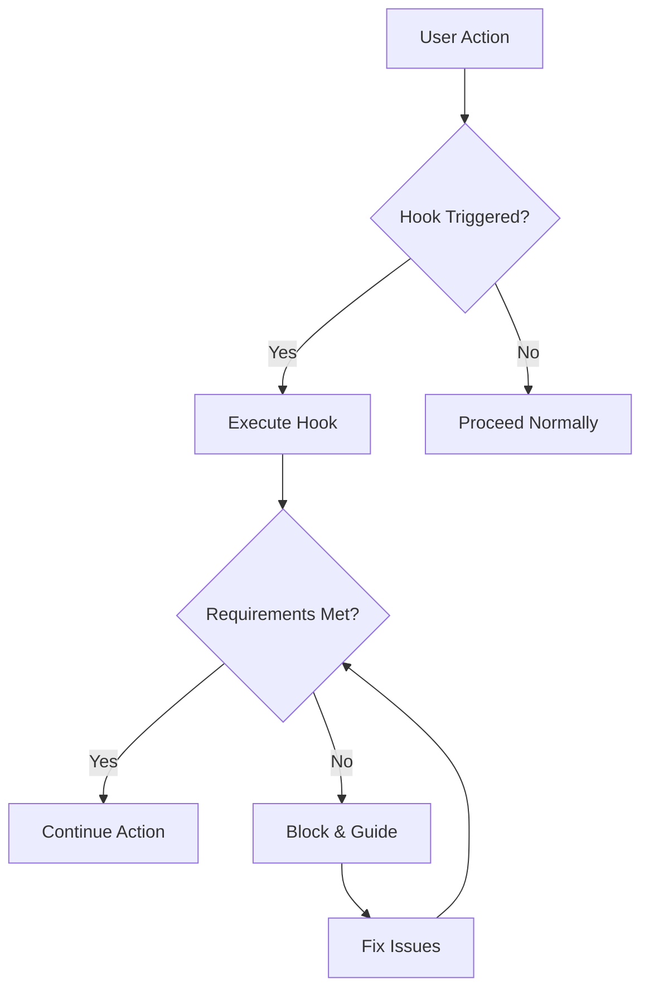

# Behavioral Hooks Registry

Automatic enforcement gates located in BEHAVIORS.md that ensure proper execution.

## Hook Categories

### 1. Work Tracking Hooks
**Purpose**: Ensure real-time documentation updates
**Triggers**: Any work activity
**Enforcement**:
- Cannot start work without work folder
- Cannot proceed without updating TRACKER.md
- Cannot complete without documenting findings
**Key Behaviors**:
- `before-starting-work`: Create/locate work folder
- `during-work`: Update tracker every significant step
- `after-work`: Document findings and decisions
**Location**: BEHAVIORS.md#work-tracking

### 2. File Operation Hooks
**Purpose**: Convention checking before edits
**Triggers**: Any file operation (create/edit/delete)
**Enforcement**:
- Cannot edit without reading first
- Cannot create without checking conventions
- Cannot delete without checking references
**Key Behaviors**:
- `before-edit`: Read file completely first
- `before-create`: Check naming and location conventions
- `before-delete`: Verify no active references
**Location**: BEHAVIORS.md#file-operations

### 3. Development Work Hooks
**Purpose**: Workflow loading before coding
**Triggers**: Implementation or feature work
**Enforcement**:
- Cannot code without workflow loaded
- Cannot implement without understanding requirements
- Cannot complete without testing
**Key Behaviors**:
- `before-implementation`: Load appropriate workflow
- `during-implementation`: Follow TDD approach
- `after-implementation`: Run validation suite
**Location**: BEHAVIORS.md#development-work

### 4. Tool Selection Hooks
**Purpose**: Right tool verification
**Triggers**: Before any tool usage
**Enforcement**:
- Cannot search without checking tool matrix
- Cannot edit without appropriate tool
- Cannot proceed with wrong tool
**Key Behaviors**:
- `before-search`: Serena for code, Grep for text
- `before-edit`: MultiEdit for multiple, Edit for single
- `before-analysis`: Choose based on need
**Location**: BEHAVIORS.md#tool-selection

### 5. Evidence & Claims Hooks
**Purpose**: Proof before assertions
**Triggers**: Any claim or statement of fact
**Enforcement**:
- Cannot claim without evidence
- Cannot assert without verification
- Cannot state as fact without proof
**Key Behaviors**:
- `before-claim`: Gather supporting evidence
- `during-assertion`: Cite specific sources
- `after-statement`: Provide file:line references
**Location**: BEHAVIORS.md#evidence-claims

### 6. Task Management Hooks
**Purpose**: TodoWrite enforcement
**Triggers**: Task creation or updates
**Enforcement**:
- Cannot work without task list
- Cannot complete without updating todos
- Cannot close without verifying completion
**Key Behaviors**:
- `before-work`: Create or load todos
- `during-work`: Update task status
- `after-work`: Verify all tasks addressed
**Location**: BEHAVIORS.md#task-management

### 7. Session Management Hooks
**Purpose**: Session coherence and compaction detection
**Triggers**: Session operations
**Enforcement**:
- Cannot start without session context
- Cannot proceed if sessions/ too large
- Cannot continue without compaction when needed
**Key Behaviors**:
- `session-start`: Initialize or restore session
- `session-check`: Monitor sessions/ size
- `session-compact`: Archive when over 1000 lines
**Location**: BEHAVIORS.md#session-management

### 8. Timestamp Accuracy Hooks
**Purpose**: Check actual time before adding timestamps
**Triggers**: Any timestamp addition
**Enforcement**:
- Cannot add timestamp without checking actual time
- Cannot use estimated times
- Cannot proceed with incorrect timestamp format
**Key Behaviors**:
- `before-timestamp`: Run `date '+%H:%M'` command
- `format-timestamp`: Use consistent format
- `never-guess`: Always use actual time
**Location**: BEHAVIORS.md#timestamp-accuracy

### 9. Git Operation Hooks
**Purpose**: Enforce proper git conventions
**Triggers**: Any git operation
**Enforcement**:
- Cannot commit without proper message format
- Cannot push without verification
- Cannot merge without review
**Key Behaviors**:
- `before-commit`: Validate message format
- `commit-format`: type(scope): description
- `after-commit`: Verify changes included
**Location**: BEHAVIORS.md#git-operations

## Hook Execution Model



## Hook Properties

### Automatic Activation
- No manual triggering needed
- Activate based on context
- Cannot be bypassed
- Always execute in order

### Enforcement Levels

1. **BLOCKING**: Cannot proceed at all
   - Wrong tool usage
   - Missing evidence
   - Convention violations

2. **WARNING**: Can proceed but shouldn't
   - Suboptimal tool choice
   - Missing documentation
   - Incomplete testing

3. **GUIDANCE**: Helpful reminders
   - Best practices
   - Optimization suggestions
   - Alternative approaches

## Hook Composition

Hooks can chain and compose:

### Example: Creating a new component
1. **Work Tracking Hook** → Create work folder
2. **Task Management Hook** → Initialize todos
3. **Development Work Hook** → Load workflow
4. **File Operation Hook** → Check conventions
5. **Evidence Hook** → Verify patterns
6. **Git Operation Hook** → Commit properly

## Common Hook Patterns

### The "Cannot Proceed" Pattern
```
Attempt action → Hook triggers → Check requirements → Block if not met
```

### The "Auto-Correct" Pattern
```
Detect issue → Hook activates → Apply fix → Continue execution
```

### The "Guided Flow" Pattern
```
Start task → Hook guides → Follow requirements → Complete successfully
```

## Hook Configuration

### Always Active Hooks
- File operations
- Evidence & claims
- Timestamp accuracy

### Context-Sensitive Hooks
- Work tracking (during development)
- Tool selection (based on operation)
- Session management (size-based)

### Optional Hooks
- None - all hooks are mandatory for consistency

## Debugging Hook Issues

When hooks seem to interfere:

1. **Check hook conditions** - Is the hook appropriate?
2. **Verify requirements** - Are requirements reasonable?
3. **Review enforcement level** - Should it block or warn?
4. **Document issues** - Report problematic hooks
5. **Suggest improvements** - Propose better enforcement

## Hook Benefits

1. **Consistency** - Same process every time
2. **Quality** - Prevents common mistakes
3. **Learning** - Teaches best practices
4. **Efficiency** - Reduces rework
5. **Confidence** - Know requirements are met

## Important Notes

- Hooks are **helpers, not hindrances**
- They prevent problems before they occur
- They ensure system integrity
- They make the "right way" the "only way"
- They eliminate decision fatigue