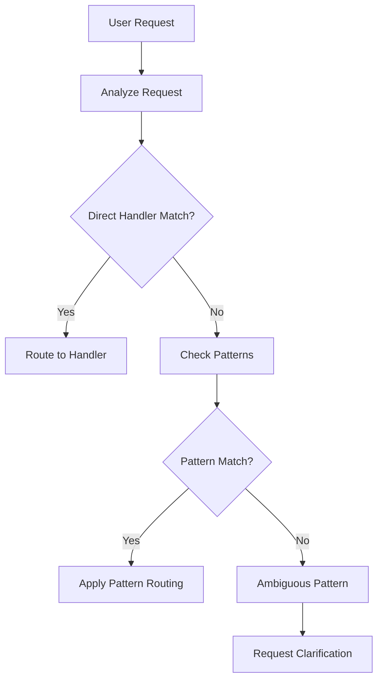

# Meta-Routing Patterns Registry

Patterns that route ambiguous requests to appropriate handlers.

## Pattern Definitions

### 1. `work-activity` Pattern
- **Purpose**: Routes general work requests
- **Triggers**: "work on", "let's do", "time to"
- **Process**:
  1. Extract work target from request
  2. Check for existing work folder
  3. Route to `continue-work` if exists
  4. Route to `start-new-work` if new
- **Location**: PATTERNS.md#work-activity

### 2. `work-continuation` Pattern
- **Purpose**: Routes continuation requests
- **Triggers**: "continue", "resume", "back to"
- **Process**:
  1. Identify previous work context
  2. Locate work folder
  3. Restore context
  4. Route to appropriate handler
- **Location**: PATTERNS.md#work-continuation
- **Guard Dependency**: Requires behavior `session/continuation-validation.md` before routing.

### 3. `file-operation` Pattern
- **Purpose**: Routes file operations
- **Triggers**: File paths, file mentions
- **Process**:
  1. Determine operation type (read/edit/create/delete)
  2. Check file conventions
  3. Route to appropriate file handler
- **Location**: PATTERNS.md#file-operation

### 4. `file-creation` Pattern
- **Purpose**: Routes file creation requests
- **Triggers**: "create file", "new file", "add file"
- **Process**:
  1. Determine file type
  2. Check naming conventions
  3. Verify location rules
  4. Route to `create-file` or specialized creator
- **Location**: PATTERNS.md#file-creation

### 5. `tool-selection` Pattern
- **Purpose**: Routes to correct tool
- **Triggers**: Tool-specific operations
- **Process**:
  1. Identify operation need
  2. Check tool matrix
  3. Select optimal tool
  4. Route to tool-specific handler
- **Location**: PATTERNS.md#tool-selection

### 6. `code-creation` Pattern
- **Purpose**: Routes code generation requests
- **Triggers**: "create", "implement", "add" + code element
- **Process**:
  1. Identify code element type
  2. Check patterns and conventions
  3. Route to `create-component` or specific creator
- **Location**: PATTERNS.md#code-creation

### 7. `evidence-check` Pattern
- **Purpose**: Routes evidence gathering
- **Triggers**: Claims or assertions needing proof
- **Process**:
  1. Identify claim type
  2. Determine evidence needed
  3. Route to `gather-evidence` or `verify-claim`
- **Location**: PATTERNS.md#evidence-check

### 8. `architecture-claim` Pattern
- **Purpose**: Routes architecture verification
- **Triggers**: Statements about system design
- **Process**:
  1. Extract architectural claim
  2. Identify verification points
  3. Route to analysis handlers
- **Location**: PATTERNS.md#architecture-claim

### 9. `time-capture` Pattern
- **Purpose**: Routes timestamp handling
- **Triggers**: Need for timestamps
- **Process**:
  1. Determine timestamp need
  2. Get actual time (never guess)
  3. Format appropriately
  4. Route to update handler
- **Location**: PATTERNS.md#time-capture

### 10. `ambiguous-request` Pattern
- **Purpose**: Handles unclear requests
- **Triggers**: Vague or multi-interpretation requests
- **Process**:
  1. Identify possible interpretations
  2. List top 3 likely handlers
  3. Ask for clarification
  4. Route once clarified
- **Location**: PATTERNS.md#ambiguous-request

### 11. `multi-step-request` Pattern
- **Purpose**: Breaks down complex requests
- **Triggers**: Requests with multiple actions
- **Process**:
  1. Parse into individual steps
  2. Order by dependencies
  3. Route each step to handler
  4. Coordinate execution
- **Location**: PATTERNS.md#multi-step-request

### 12. `lost-context` Pattern
- **Purpose**: Helps reorientation
- **Triggers**: "where were we", "what were we doing"
- **Process**:
  1. Check sessions/
  2. Check active work folders
  3. Review recent activity
  4. Restore context
- **Location**: PATTERNS.md#lost-context

### 13. `system-improvement` Pattern
- **Purpose**: Routes meta-improvements
- **Triggers**: "improve the system", "add handler"
- **Process**:
  1. Identify improvement type
  2. Check existing patterns
  3. Route to meta-agent or specialist
- **Location**: PATTERNS.md#system-improvement

### 14. `workflow-gap-detection` Pattern
- **Purpose**: Routes workflow gaps into the meta workflow authoring process
- **Triggers**: Guard reports missing workflow, explicit request for new workflow, registry lookup failure
- **Process**:
  1. Record gap evidence (session + tracker)
  2. Confirm plan compliance and sync log
  3. Route to `handlers/orchestrators/meta-workflow-authoring.md`
  4. Block further edits until workflow authoring completes
- **Location**: patterns/integration/workflow-gap-detection.md

## Pattern Recognition Flow



## Pattern Priority Order

When multiple patterns could match:

1. **Exact matches first** - Direct handler triggers
2. **Specific patterns** - Domain-specific patterns
3. **General patterns** - Work-activity, file-operation
4. **Ambiguous pattern** - When unclear
5. **Multi-step pattern** - For complex requests

## Pattern Composition

Patterns can compose and delegate:

### Example: "Fix the bug and commit the changes"
1. `multi-step-request` pattern activates
2. Breaks into: ["fix bug", "commit changes"]
3. Step 1 routes through `fix-bug` handler
4. Step 2 routes through `commit-changes` handler
5. Coordinates execution order

## Pattern vs Handler

### Patterns
- **Meta-level routing** - Decide which handler to use
- **Ambiguity resolution** - Handle unclear requests
- **Request decomposition** - Break complex into simple
- **Context awareness** - Consider current state

### Handlers
- **Direct execution** - Perform specific tasks
- **Clear triggers** - Respond to specific phrases
- **Defined workflow** - Follow set process
- **Tool usage** - Execute with tools

## Common Pattern Chains

### Development Flow
```
work-activity → start-new-work → create-component → evidence-check
```

### Debug Flow
```
ambiguous-request → evidence-check → fix-bug → multi-step-request
```

### Search Flow
```
tool-selection → search-code → evidence-check → cite-source
```

## Anti-Patterns to Avoid

1. **Pattern loops** - Pattern A → Pattern B → Pattern A
2. **Over-routing** - Too many patterns before handler
3. **Pattern misuse** - Using patterns for direct handler work
4. **Context loss** - Losing request intent through routing

## Pattern Debugging

When pattern routing seems wrong:
1. Check pattern trigger conditions
2. Verify pattern precedence
3. Review pattern process steps
4. Ensure handler compatibility
5. Document pattern gaps for improvement
